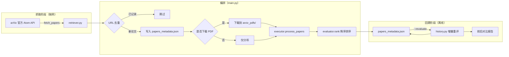

# New Paper Scraper

模拟 Zotero-arXiv-Daily 爬虫机制的 arXiv 论文发现与价值排序工具：按关键词抓取
arXiv 最新论文，用可配置的启发式评分排序，持久化历史记录，并支持评分口径
变更后对历史数据做增量回溯重评。

## 功能概览

| 能力 | 说明 |
| --- | --- |
| 抓取 | 按关键词搜索 arXiv 官方 Atom API，解析标题、作者、链接、摘要、提交时间 |
| 去重 | 与历史记录比对 URL，只处理新论文 |
| 评分 | 5 个基础维度的加权启发式评分，另有 `venue` / `institution` 两个**条件维度**（只在拿到数据时参与）；可选接入 Semantic Scholar / Hugging Face / LLM 增强 |
| 下载 | 可选下载 PDF 到本地（默认关闭，仅分析元数据） |
| 回溯 | 权重调整后增量重评历史记录，并输出改动前后的对比报告 |
| 测试 | 离线单元测试 + 联网多关键词端到端测试 |

仓库里还包含一个**完整的 iOS 移植**（Swift 内核 + SwiftUI App），
并与 Python 版做逐维度、逐字段的对拍验证 —— 见下文 [iOS 版](#ios-版)。

## 工作原理



## 环境要求

- Python 3.8 及以上（开发环境为 3.13）
- 可访问 `export.arxiv.org`（`--external` 另需访问 Semantic Scholar /
  Hugging Face，`--llm` 需可访问 OpenAI 兼容接口）

> 抓取层使用 arXiv 官方 Atom API。相比早期版本的"抓搜索页 + BeautifulSoup 解析
> HTML"，它返回结构化 XML 且不依赖未公开承诺的页面类名，因而**移除了
> `beautifulsoup4` 依赖**。请求侧带描述性 User-Agent、超时、分页限速与
> 429/5xx 退避重试，遵守官方 API 的使用规范。

## 安装

```bash
pip install -r requirements.txt
```

## 快速开始

```bash
# 1. 抓取并按默认关键词 "LLM" 评分（不下载 PDF）
python main.py

# 2. 指定关键词，同时下载 PDF
python main.py --query "retrieval-augmented generation" --download

# 3. 调整评分权重后，回溯历史记录做增量重评并看对比
python main.py --revaluate --report report.txt
```

## 项目结构

```
.
├── main.py                      # 入口：参数解析 + 两种工作模式编排
├── retriever.py                 # arXiv 官方 Atom API 客户端 + XML 解析
├── evaluator.py                 # 评分核心：启发式 + 外部增强 + LLM
├── executor.py                  # 排序输出 + PDF 下载
├── history.py                   # 历史回溯 / 增量评价 / 前后对比
├── papers_metadata.json         # 历史记录（唯一的数据文件）
├── papers_metadata.backup.json  # --revaluate 自动备份（可删）
├── test_weights.py              # 测试：权重与排序（离线）
├── test_history.py              # 测试：回溯 / 增量 / 对比（离线）
├── test_keywords.py             # 测试：热门关键词端到端（联网）
├── tools/
│   └── export_golden.py         # 导出评分金标准，供 Swift 端对拍
├── ios/                         # iOS 移植（Swift 内核 + SwiftUI App）
│   ├── PaperScraperCore/        #   纯逻辑内核（SPM 包，可脱离 Xcode 测试）
│   ├── PaperScraper/            #   SwiftUI App
│   └── README.md                #   移植说明、踩坑记录、构建与验证方式
├── requirements.txt             # 依赖：requests
├── .gitignore                   # 忽略运行产物
└── arxiv_pdfs/                  # 下载的 PDF（由 --download 创建，可删）
```

各模块的详细约定见文件头部的模块 docstring。

## 命令行参数

`python main.py [选项]`

| 参数 | 默认 | 说明 |
| --- | --- | --- |
| `--query` | `LLM` | arXiv 搜索关键词 |
| `--max N` | `50` | 单次最多抓取条数；超过单页上限会自动分页 |
| `--sort` | `relevance` | `relevance`（相关度）或 `submitted`（按提交时间倒序） |
| `--download` | 关闭 | 下载 PDF 到 `arxiv_pdfs/`。也可用环境变量 `ARXIV_DOWNLOAD_PDF=1` 开启 |
| `--limit N` | 不限 | 只处理前 N 篇**新**论文，便于快速试跑（元数据仍会全部记录） |
| `--external` | 关闭 | 启用 Semantic Scholar / Hugging Face 外部数据增强 |
| `--llm` | 关闭 | 启用 LLM 语义评分，需 `OPENAI_API_KEY` |
| `--revaluate` / `--refresh` | 关闭 | 进入历史回溯模式：增量重评 + 前后对比报告（不联网） |
| `--force` | 关闭 | 配合 `--revaluate`：忽略增量判断，强制重算全部历史记录 |
| `--top N` | `10` | 对比报告中的 Top-N |
| `--report FILE` | 不写文件 | 把对比报告写入指定文件 |
| `--no-backup` | 关闭 | 配合 `--revaluate`：重评落盘前不生成 `.backup.json` 备份 |

## 评分机制

综合分范围 0~100，由三层依次叠加得到：

```
启发式加权和 × 100  →  (可选) 混入外部引用分  →  (可选) 混入 LLM 语义分
```

### 默认权重

定义在 `evaluator.py` 的 `HeuristicEvaluator.DEFAULT_WEIGHTS`：

| 维度         | 权重 | 说明                         |
| ------------ | ---- | ---------------------------- |
| `topic`    | 0.30 | 主题热度                     |
| `title`    | 0.20 | 标题质量                     |
| `author`   | 0.20 | 作者信号                     |
| `abstract` | 0.15 | 摘要信息量（已由 0.30 下调） |
| `recency`  | 0.15 | 时效性                       |

权重在初始化时自动归一化，因此只需填写相对比例，不必凑满 1.0。
`abstract` 之所以从 0.30 下调到 0.15，是因为摘要的长度与套话特征极易被人为
堆砌：实测 150 篇样本该维度标准差仅约 0.17，区分度低于 `topic`，却占了三成
权重，容易把"摘要写得长"的论文顶到前排。

### 各维度评分细则

| 维度 | 打分依据 |
| --- | --- |
| `title` | 基准 0.5；词数 8~20 加 0.20（5~8 或 20~25 加 0.10）；含冒号加 0.10；命中方法词（`benchmark`/`framework`/`rethinking` 等）加 0.10；问号结尾加 0.05；命中模板短语（`all you need` 等）减 0.05 |
| `author` | 基准 0.5；2~8 人加 0.20；单作者减 0.10；超过 15 人减 0.05；含 `et al` 减 0.05；命中机构词（`google`/`tsinghua`/`mit` 等）加 0.20；无作者信息记 0.2 |
| `abstract` | 长度 500~2000 加 0.30；方法词（`we propose`/`framework` 等）命中 ≥2 个加 0.20；结果词（`outperform`/`state-of-the-art` 等）同理；含百分比加 0.15；含 `Nx`/`fold`/`times` 加 0.10；含 `benchmark`/`ablation` 等加 0.10 |
| `recency` | ≤30 天记 1.0；30~90 天从 1.0 线性降到 0.5；90~365 天从 0.5 降到 0.2；超过一年记 0.2；日期无法解析记 0.3 |
| `topic` | $1 - e^{-\sum w / 2}$，$\sum w$ 为命中 `TOPIC_KEYWORDS` 词表的权重之和，命中越多越接近 1.0 |
| `venue` | 仅当文本出现 `accepted`/`published`/`proceedings` 等信号时才参与；顶会顶刊记 0.9、workshop 记 0.5、其他记 0.3，并占用 0.10 权重，其余维度等比缩放 |

各维度最终都被裁剪到 `[0, 1]`。

### 可选增强

| 开关 | 效果 |
| --- | --- |
| `--external` | 从 Semantic Scholar 取引用量、作者平均 h-index，从 Hugging Face 取点赞数。外部分 $= (0.7 \cdot \text{citation} + 0.3 \cdot h) \times 100$，其中 $\text{citation} = \log(1+c)/\log(1001)$、$h = \min(1, \bar{h}/50)$。最终分按 **0.20** 权重混入 |
| `--llm` | 调用 OpenAI 兼容接口，让模型对新颖性、严谨性、清晰度、潜在影响、热点相关性五个维度打 0~10 分，换算为 0~100 后按 **0.30** 权重混入。需设置 `OPENAI_API_KEY`（可选 `OPENAI_BASE_URL`、`OPENAI_MODEL`，默认 `gpt-4o-mini`） |

两个开关都只影响**最终分**，不改变任何维度的原始分。

## 历史回溯 · 增量评价

常规流程会跳过 `papers_metadata.json` 中已记录的论文，因此历史记录永远不会
被重算。调整评分权重后，用 `--revaluate` 回溯已有记录：

```bash
python main.py --revaluate                  # 增量重评 + 前后对比报告
python main.py --revaluate --report r.txt   # 同时把报告写入文件
python main.py --revaluate --force          # 忽略增量判断，全部重算
python main.py --revaluate --top 20         # 报告中 Top-N 取 20
python main.py --revaluate --no-backup      # 不生成 .backup.json 备份
```

该模式不联网、不抓取，只读写本地元数据。执行时会：

1. **判断每条历史评分是否失效**，只为失效的记录重算，其余沿用旧结果：

   | 原因                | 含义                                   |
   | ------------------- | -------------------------------------- |
   | `missing`         | 历史记录里没有评分                     |
   | `config_changed`  | 权重 / 外部增强 / LLM 配置与当前不一致 |
   | `content_changed` | 标题 / 作者 / 摘要 / 提交时间变化      |
   | `recency_expired` | 评分日期不是今天（时效性维度需要刷新） |

   同一天、同一份权重下重复执行会全部跳过，做到真正的增量。
2. **输出前后对比报告**：分数变化（均值 / 绝对均值 / 最大升降）、排序稳定性
   （Spearman 秩相关、Top-N 重合数）、名次变动 Top-5、各维度平均分变化。
3. 把新评分连同 `config_key`、`content_hash`、`evaluated_on` 写回元数据，
   并默认生成 `papers_metadata.backup.json` 备份。

评分溯源字段由 `PaperEvaluator` 在每次评分时自动写入，也是增量判断的依据。

## iOS 版

`ios/` 下是完整的 iOS 移植。**评分内核可脱离 Xcode 单独测试**，方便持续对拍；
详细的踩坑记录、页面结构分析与验证数据见 [`ios/README.md`](ios/README.md)。

```
ios/
├── PaperScraperCore/   # 纯逻辑内核（SPM 包）：抓取 / 评分 / 回溯 / 图表与机构解析
└── PaperScraper/       # SwiftUI App
```

### 相对 Python 版多出的能力

| 能力 | 说明 |
| --- | --- |
| **标题 / 摘要中文翻译** | 可插拔引擎（Apple Intelligence 端侧 / OpenAI 兼容云端）+ 术语表 + 学术翻译提示词，译文本地缓存 |
| **论文图表 + 核心图** | 解析 arXiv 原生 HTML：自动挑出最核心的一张放在详情页显眼处，全部图表列在底部；列表页显示核心图缩略图 |
| **矢量图（SVG）** | 实测 arXiv 的图**约一半是 SVG**，UIKit 解不了；用 WebKit 离屏栅格化后缓存复用 |
| **作者机构** | 从同一次 HTML 抓取里解析作者块，作为「机构」维度计入评分，并显示在列表与详情页 |
| **手机端看图** | 宽图自动进「分段」模式：以高度铺满为基准缩放，再按视口宽分页左右翻阅 |

### 构建与测试

```bash
# 内核测试（含与 Python 的 100 条金标准对拍，不需要 Xcode GUI）
cd ios/PaperScraperCore && swift test

# 构建 App
cd ios && xcodebuild -project PaperScraper.xcodeproj -scheme PaperScraper \
  -destination 'generic/platform=iOS Simulator' CODE_SIGNING_ALLOWED=NO build
```

要求 Xcode 16+（工程用了 `PBXFileSystemSynchronizedRootGroup`）、iOS 17.0+。
端侧翻译引擎额外需要 iOS 26 与已开启的 Apple Intelligence，用 `@available` 单独门控。

### 两端一致性

移植采用「**Swift 重写 + Python 定规**」：Python 侧是事实标准，由
`tools/export_golden.py` 固化成 **100 条金标准用例**（覆盖权重变体、内容指纹、
维度边界与词边界反例），Swift 侧逐维度、逐字段对齐。改了 `evaluator.py` 的
评分逻辑后需要重新生成：

```bash
python tools/export_golden.py --real 25
```

两端共用同一种 `papers_metadata.json`，含 `config_key` / `content_hash` /
`evaluated_on` 三个溯源字段，历史记录可以直接互通（150 条真实历史记录在 iOS 侧
解码后 `config_key` 全部匹配）。

已验证（**不含机构维度**时，即两端输入完全相同）：同一批从 arXiv 实时抓取的
50 篇论文，Swift 与 Python 的 `final_score`、`dimension_scores`、`config_key`、
`content_hash` **零差异**；真机上 100 篇同样逐篇零差异。

> ⚠️ **一处有意的不对称**：`institution`（机构）维度两端都实现了，但**只有 iOS
> 侧会去抓机构**。所以带机构信息的论文在 App 里的分数会与 Python 侧不同 ——
> 这是设计选择（Python 流水线不解析 HTML，拿不到机构）。
> 不做抓取时该维度整体缺席，两端结果依旧逐位一致，这也是既有历史记录
> 不受影响的原因。

> iOS 侧的定时能力有硬约束：`BGAppRefreshTask` 由系统决定何时执行、不保证按时
> 触发，"每天定时抓取"无法只靠客户端兑现。若需要真正的每日定时 + 推送，
> 应补一个服务端定时任务。

## 数据文件

项目只有一个数据文件 `papers_metadata.json`，是一个论文对象数组。
抓取阶段写入前 5 个字段，评分阶段追加 `evaluation`：

```jsonc
[
  {
    "title": "Beyond Vector Similarity: ...",   // 标题，解析失败为 "N/A"
    "authors": "Alice, Bob",                    // 逗号分隔，解析失败为 "N/A"
    "url": "https://arxiv.org/abs/2609.11892",  // 摘要页链接；PDF 直链由 /abs/ 换 /pdf/ 推导
    "abstract": "...",                          // 摘要，已剔除 More/Less 切换链接
    "submission_time": "2026-09-10",            // 归一化为 YYYY-MM-DD，失败为 "N/A"
    "evaluation": {
      "dimension_scores": { "title": 0.9, "author": 0.7, "abstract": 0.95,
                            "recency": 1.0, "topic": 0.97 },
      "weights":     { "title": 0.2, "author": 0.2, "abstract": 0.15,
                       "recency": 0.15, "topic": 0.3 },
      "base_score":  87.5,    // 仅启发式部分
      "final_score": 87.5,    // 叠加外部 / LLM 之后的最终分
      "external":    null,    // --external 的原始结果
      "llm":         null,    // --llm 的原始结果
      "config_key":   "2d27de8f1078",       // 评分配置指纹
      "content_hash": "ec0db79e70b2408f",   // 参与评分的文本字段指纹
      "evaluated_on": "2026-09-16"          // 评分日期
    }
  }
]
```

最后三个字段是增量评价的判据，缺失它们的历史记录会被视为过期并在下次
`--revaluate` 时补全。

`papers_metadata.backup.json` 是 `--revaluate` 落盘前的自动备份，用于误操作
回滚；确认结果无误后可安全删除，下次重评会重新生成。

## 测试

```bash
python test_weights.py     # 权重归一化、分值区间与排序稳定性（离线）
python test_history.py     # 失效判断、增量语义、对比指标与端到端（离线）
python test_keywords.py    # 10 个 AI 热门关键词的端到端测试（联网）
python evaluator.py        # 直接对 papers_metadata.json 做一次排名
python history.py          # 直接输出一次回溯对比报告（不落盘）
```

### 热门关键词测试

`test_keywords.py` 会真实访问 arXiv，覆盖当前 AI 研究的 10 个热门方向，
验证 retriever 抓取 + evaluator 评分在不同主题下都稳定可用：

| 方向 | 关键词 |
| --- | --- |
| 基础模型 | `large language model` |
| 智能体 | `agent` |
| 检索增强 | `retrieval-augmented generation` |
| 推理 | `chain-of-thought` |
| 多模态 | `multimodal` |
| 生成模型 | `diffusion` |
| 安全对齐 | `LLM safety` |
| 高效推理 | `quantization` |
| 强化学习 | `reinforcement learning` |
| 推理时扩展 | `test-time scaling` |

另设一个与上述热点无关的对照组（`geology`），用来验证 `topic` 维度确实有
区分度——热点关键词的 topic 均分应显著高于对照组。

脚本只读不写，不会污染 `papers_metadata.json`。

```bash
python test_keywords.py --save out.json        # 保存原始统计结果
python test_keywords.py --delay 0              # 取消请求间隔（arXiv 可能限流）
python test_keywords.py --keywords "agent" "rag"   # 自定义关键词
python test_keywords.py --control ""           # 不跑对照组
```

#### 实测结果（2026-09-16）

10 个关键词各取 50 篇，共 500 篇，耗时约 23 秒：

| 关键词 | 均分 | 标准差 | topic | 热点词命中率 |
| --- | --- | --- | --- | --- |
| `large language model` | 78.22 | 6.11 | 0.821 | 100% |
| `agent` | 73.78 | 6.76 | 0.719 | 100% |
| `retrieval-augmented generation` | 79.51 | 7.43 | 0.839 | 100% |
| `chain-of-thought` | 79.86 | 5.30 | 0.869 | 100% |
| `multimodal` | 74.83 | 8.78 | 0.719 | 98% |
| `diffusion` | 62.87 | 8.69 | 0.405 | 86% |
| `LLM safety` | 82.37 | 3.89 | 0.910 | 100% |
| `quantization` | 67.08 | 11.08 | 0.514 | 90% |
| `reinforcement learning` | 74.24 | 7.60 | 0.720 | 100% |
| `test-time scaling` | 64.88 | 11.17 | 0.405 | 80% |
| **[对照] `geology`** | 51.41 | 11.73 | 0.265 | 58% |

结论：所有字段解析完整率 100%，综合分全部落在 41.5~90.8；热点关键词的
topic 均分 0.692，显著高于对照组 0.265，说明 `topic` 维度确有区分度。

## 已知限制

**抓取与数据**

- **PDF 文件名可能冲突**：文件名由标题过滤后截断前 100 字符生成，标题相近的
  论文会互相覆盖。
- **`submission_time` 取的是 v1 提交日**：来自 Atom API 的 `<published>`，
  论文后续更新版本不会改变这个日期。若想按最新版本排序，需要改用 `<updated>`。

**评分**

- **结果是启发式排序**：用于初筛，不等同于论文实际价值，不建议作为唯一依据。
- **`--llm` 需要额外凭证**：未设置 `OPENAI_API_KEY` 时该开关静默失效。
- **`venue` 与 `institution` 是「有条件参与」的维度**：没有相应数据的论文不参与
  这两个维度的加权，因此**带数据与不带数据的论文可比性会变弱**。
  这是为了让既有历史记录的分数不因新增维度而整体漂移所做的取舍。

**iOS 侧**

- **图表与机构依赖 arXiv 原生 HTML**：不是每篇论文都有该版本，没有的取不到图表
  与机构（详情页会明确说明并给出 PDF 入口）。
- **矢量图（SVG）首次查看会多等一两秒**：约占图数一半，需要 WebKit 栅格化，
  结果会缓存复用。
- **极少数论文的图片路径在 arXiv 侧就是坏的**（实测 35 篇里 1 篇返回 404），
  App 会自动退选下一张当核心图，而不是留一个空框。
- **机构名可能被 LaTeXML 误标**：已知的一类是作者人名被标成 affiliation，
  已按"多词 + 无逗号 + 无机构后缀词"过滤，但无法保证百分之百。
- **后台定时不可靠**：见上文「iOS 版」的说明。
