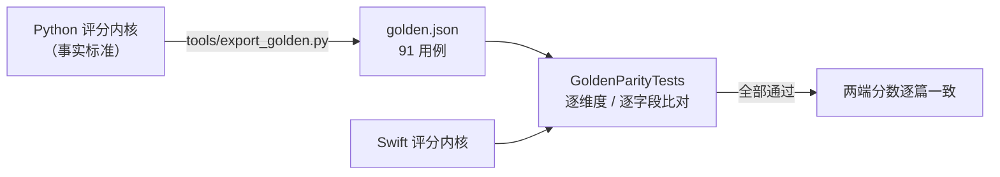

# iOS 版（PaperScraper）

Python 版 `new-paper-scraper` 的 iOS 移植。抓取、评分、增量回溯的内核全部用 Swift
重写，并与 Python 版做**逐篇分数的对拍验证**，两端共用同一种
`papers_metadata.json` 格式。

```
ios/
├── PaperScraperCore/            # 纯逻辑内核（SPM 包，可独立测试）
│   ├── Sources/PaperScraperCore/
│   │   ├── Models.swift             # Paper / Evaluation / JSONValue
│   │   ├── PyCompat.swift           # CPython 语义兼容层（round / len / sha1 / 正则）
│   │   ├── Keywords.swift           # 词表（与 evaluator.py 逐项对应）
│   │   ├── HeuristicEvaluator.swift # 5 个常规维度 + venue / institution 条件维度
│   │   ├── PaperEvaluator.swift     # 组合 + 配置指纹 + 内容指纹 + 排序
│   │   ├── History.swift            # 增量判据 / 重评 / 对比报告
│   │   ├── ArxivClient.swift        # arXiv Atom API 客户端 + XML 解析
│   │   ├── Enrichment.swift         # 可选：S2/HF 引用增强、LLM 语义评分
│   │   ├── FigureExtractor.swift    # arXiv HTML 图表解析 + 核心图选择 + 作者机构
│   │   └── PaperStore.swift         # 元数据读写与备份
│   └── Tests/PaperScraperCoreTests/ # 99 个测试，含 100 条金标准对拍
└── PaperScraper/                # SwiftUI App
    ├── PaperScraperApp.swift        # @main + AppDelegate（注册后台任务）
    ├── AppModel.swift               # 状态与用例编排
    ├── ContentView.swift            # 排名列表 / 搜索 / 下拉刷新 / 行内评分维度
    ├── FlowLayout.swift             # 自动换行的流式布局（评分 chip 铺满正文列）
    ├── PaperDetailView.swift        # 评分拆解 / 摘要 / 核心图 / 全部图表
    ├── Figures.swift                # 图表缓存 / 核心图卡片 / 缩略图 / 查看器
    ├── VectorFigure.swift           # SVG 离屏栅格化（WebKit）+ 统一图片视图
    ├── Translation.swift            # 译文模型与缓存
    ├── TranslationEngine.swift      # 可插拔翻译引擎 + 术语表 + 学术提示词
    ├── SettingsView.swift           # 取代命令行参数与环境变量
    ├── HistoryView.swift            # 回溯重评与对比报告
    └── Support.swift                # 设置 / Keychain / 网络策略 / 后台刷新 / 通知
```

## 快速开始

```bash
# 1. 只跑内核测试（无需 Xcode GUI，验证与 Python 的分数一致性）
cd ios/PaperScraperCore && swift test

# 2. 构建 App
cd ios
xcodebuild -project PaperScraper.xcodeproj -scheme PaperScraper \
  -destination 'generic/platform=iOS Simulator' CODE_SIGNING_ALLOWED=NO build

# 3. 或者直接用 Xcode 打开
open ios/PaperScraper.xcodeproj
```

要求：Xcode 16 及以上（工程用了 `PBXFileSystemSynchronizedRootGroup`，即
objectVersion 77）、iOS 17.0+。

> 端侧翻译引擎需要 iOS 26 且已开启 Apple Intelligence，用 `@available` 单独门控；
> 其余功能在 iOS 17 上均可运行（包括云端翻译引擎）。

> 上架前需要补：App 图标（`Assets.xcassets` 目前是空目录）；
> Bundle Identifier 目前是 `com.chengkai.paperscraper`（配合本机 Personal Team），
> 正式发布前请换成你自己的域名。

## 移植策略：Swift 重写 + Python 定规

没有选择打包 CPython 运行时（Briefcase / Pyto 那种路线），原因是审核风险与启动体积；
但也没有"照着感觉重写"，而是把 Python 版固化成**金标准**，让 Swift 实现逐条对齐。



```bash
# 重新生成金标准（改了 Python 侧评分逻辑后必须执行）
python tools/export_golden.py --real 25
```

金标准覆盖：

| 内容 | 数量 | 说明 |
| --- | --- | --- |
| 评分用例 | 91 | 合成边界用例 + 25 条真实历史记录 |
| 权重档位 | 4 | default / old / custom / topic_only |
| 配置指纹 | 8 | 权重 × 增强开关组合 |
| 内容指纹 | 16 | 含"缺字段 / 值为 null / 含中文"等形态 |
| 关键词探针 | 20 | 词边界、复数、大小写、中英混排 |

### 为了"逐位一致"必须抹平的语言差异

这是移植中最容易被忽略、也最容易导致分数悄悄漂移的地方，全部收敛在
`PyCompat.swift` 里：

| 差异点 | Python | Swift 默认行为 | 处理方式 |
| --- | --- | --- | --- |
| 四舍五入 | 半偶进位 `round(0.5)==0` | 半远离零 `0.5→1` | `NSDecimalRound(.bankers)` |
| Decimal → Double | 正确舍入 | `NSDecimalNumber.doubleValue` 差 1 ULP | 转成十进制字符串再 `Double(_:)` |
| 字符串长度 | 按 Unicode 码点 | `String.count` 按字素簇 | `unicodeScalars.count` |
| 浮点求和顺序 | dict 插入顺序 | 字典无序 | 固定 `dimensionOrder` |
| `\b` 词边界 | Unicode `\w` | ICU 对 `\-` 转义敏感 | 手工实现边界判定 |
| `\d` / `\s` | Unicode 分类 | — | `CharacterSet.decimalDigits` / `.whitespacesAndNewlines` |
| `json.dumps` 浮点 | 最短往返表示 | `JSONEncoder` 格式不同 | 手工拼串 + `String(Double)` |
| 排序稳定性 | `list.sort` 稳定 | `sort` 不稳定 | 显式加入原始下标作次序键 |

## 与 Python 版的对照

| Python | iOS |
| --- | --- |
| `python main.py` | 列表页下拉刷新 / 右上角刷新按钮 |
| `--query` / `--max` / `--sort` | 设置页「抓取」 |
| 权重 / `--external` / `--llm` | 设置页「评分」 |
| `OPENAI_API_KEY` 环境变量 | 设置页输入，存 Keychain |
| `--revaluate` / `--force` / `--top` | 「回溯对比」页 |
| `--report FILE` | 报告页「导出报告」（系统分享） |
| cron 定时 | `BGAppRefreshTask`（**尽力而为**，见下） |
| `--download` 落盘 PDF | 改为按需打开外链，不落盘 |
| （Python 版没有） | **标题 / 摘要中文翻译**（可插拔引擎 + 术语表，见下） |
| （Python 版没有） | **论文图表：核心图 + 全部图表 + 矢量图**（解析 arXiv HTML，见下） |
| （Python 版没有） | **作者机构：抓取 + 参与评分 + 列表展示**（同一次 HTML 抓取，见下） |

### 数据文件

两端读写完全相同的 `papers_metadata.json`：键名、`dimension_scores`、`weights`、
`config_key`、`content_hash`、`evaluated_on` 都一致，可以直接把 Python 侧的历史
记录拷进 App（模拟器验证过 150 条真实记录全部解码成功、`config_key` 全部匹配）。

已知差异：Python 用 `indent=4`，Swift 用 `.prettyPrinted`（2 空格）+ `.sortedKeys`。
缩进不同但语义等价，且 Swift 侧会按键排序，diff 反而更稳定。

## 与 Python 侧的有意差异（设计决策）

1. **抓取源换成官方 Atom API**（Python 侧一并改了）。
   原来抓 `arxiv.org/search/` 页面并依赖 `li.arxiv-result` 这类未公开承诺的类名，
   arXiv 改版即全线失败。改用 `export.arxiv.org/api/query` 后：结构化 XML、
   自带 ISO 8601 时间戳、支持分页，并且**去掉了 `beautifulsoup4` 依赖**。

2. **不落盘 PDF**。150 篇约 174 MB，在 iOS 上会同时抬高沙箱占用与 iCloud 备份
   体积。详情页改为直接打开 arXiv 的 PDF 链接。

3. **`ArxivClient` 是 actor**。Python 版是一条同步流程；iOS 侧改成 `actor`
   以保证"同一时刻只有一个请求在飞"，并加了三个 Python 版没有的东西：
   请求超时、429/5xx 指数退避重试、`Task` 取消检查。
   （Python 版原本 `requests.get` 连 timeout 都没设。）

4. **评估器拆成两段**。Python 的 `PaperEvaluator.evaluate()` 内部同步发 HTTP 请求；
   Swift 侧拆成纯函数 `evaluate()` + 异步 `applying()`，让可复现的部分保持
   `Sendable` 且易于对拍，网络部分保持可取消。

5. **文件保护等级**。写入 `papers_metadata.json` 时显式设为
   `completeUntilFirstUserAuthentication`。默认的 `NSFileProtectionComplete`
   会让锁屏后文件不可读写，而后台刷新恰恰只在锁屏时发生。

6. **前后台用两个网络客户端**。后台预算只有约 30 秒，而默认参数的
   `ArxivClient` 最坏耗时是「4 次尝试 × 30 秒超时 + 1+2+4 秒退避 ≈ 127 秒」，
   在后台必然被系统掐断。因此 `AppModel` 额外持有一个
   `ArxivClient(timeout: 15, minInterval: 3.0, maxRetries: 1)` 专供后台使用
   （最坏约 32 秒），同时保留 3 秒请求间隔以继续遵守 arXiv 的 API 规范。

## 在实机上测试

模拟器验证不了的只有两件事：**真实的后台刷新**和**真实的网络/锁屏行为**。
其余（抓取、评分、持久化、界面）用模拟器测就够了。

### 前置准备（一次性）

1. **添加 Apple ID 到 Xcode**
   `Xcode → Settings → Accounts → +` 登录 Apple ID。
   免费账号即可，但限制是：**证书 7 天过期、最多 3 个 App、无法使用
   Push Notifications / iCloud 等能力**。本 App 用到的后台刷新（`UIBackgroundModes`）
   不依赖受限能力，免费账号可用。

2. **改 Bundle Identifier**
   `com.example.*` 这类占位标识符几乎一定会与他人冲突而签名失败，必须换成
   自己的唯一标识（本项目当前用的是 `com.chengkai.paperscraper`）：
   Xcode → 选中 `PaperScraper` target → General → Bundle Identifier。
   注意：改了 Bundle ID 之后，后台任务标识符**也必须同步**（见下面"验证后台刷新"）。

3. **选择签名团队**
   target → Signing & Capabilities → 勾选 `Automatically manage signing`
   → Team 选你的 Apple ID（个人团队）。
   Xcode 会自己把 `DEVELOPMENT_TEAM` 写进 `project.pbxproj`。

4. **iPhone 上开启开发者模式**（iOS 16+）
   设置 → 隐私与安全性 → 开发者模式 → 打开 → 重启。
   首次连接时 iPhone 会弹"信任此电脑"，需要在手机上确认。

### 部署与运行

```bash
# 确认设备已连接（应出现在列表中，Reality 为 physical）
xcrun devicectl list devices

# 查看可用于签名的身份（应至少有一个 Apple Development）
security find-identity -v -p codesigning

# 命令行构建并安装（把 UDID 换成你自己的）
cd ios
DEVICE=<你的设备 UDID>

xcodebuild -project PaperScraper.xcodeproj -scheme PaperScraper \
  -configuration Debug -destination "id=$DEVICE" \
  -allowProvisioningUpdates build

xcrun devicectl device install app --device "$DEVICE" \
  ~/Library/Developer/Xcode/DerivedData/PaperScraper-*/Build/Products/Debug-iphoneos/PaperScraper.app
```

> 注意：真机构建**必须签名**，不能再加 `CODE_SIGNING_ALLOWED=NO`。
> 最省事的方式其实是直接用 Xcode 打开工程、选中设备、按 ⌘R。

首次启动若提示"不受信任的开发者"，去设置 → 通用 → VPN与设备管理 → 信任你的证书。

### 验证后台刷新（真机专有）

后台刷新在模拟器上**完全不可用**（`BGTaskScheduler.submit` 会稳定报错），
只能真机测。三种方式，由易到难：

**方式一：临时缩短排期（最实用）**

把 `Support.swift` 里的常量改小，然后重启 App：

```swift
static let minimumDelay: TimeInterval = 60   // 调试用；上线前改回 6 * 3600
```

之后把 App 退到后台、锁屏，等待几分钟。
在 Xcode 的 Debug 控制台或 Console.app 里过滤 `PaperScraper`，
看到抓取日志即说明后台任务被系统调度了。

**方式二：LLDB 强制触发（不用等）**

在 Xcode 里跑起来后，暂停程序（⌘Y / Debug → Pause），在 LLDB 里执行：

```
e -l objc -- (void)[[BGTaskScheduler sharedScheduler] _simulateLaunchForTaskWithIdentifier:@"com.chengkai.paperscraper.refresh"]
```

继续运行即会走一遍后台处理逻辑。想验证"系统提前收回"的降级路径，用：

```
e -l objc -- (void)[[BGTaskScheduler sharedScheduler] _simulateExpirationForTaskWithIdentifier:@"com.chengkai.paperscraper.refresh"]
```

（标识符必须在**三处**完全一致：`BackgroundRefresh.taskIdentifier`、
`Info.plist` 的 `BGTaskSchedulerPermittedIdentifiers`、以及上面的 LLDB 命令。
它不要求与 Bundle ID 相同，但按惯例会用 Bundle ID 作前缀。如果你改了
Bundle ID，可以顺手把这里也改成 `com.yourname.paperscraper.refresh`，
**但一定要三处同时改**，否则注册时会直接抛断言崩溃。）

**方式三：等系统自己调度（最真实也最慢）**

`earliestBeginDate` 只是"最早可以开始"。系统会参考你的使用习惯，
通常需要把 App 反复退到后台、并在设备充电且网络良好时才会触发，
实际观测往往是数小时到一天不等。这也是为什么它不能当作"定时任务"用。

> ⚠️ Xcode 的 `Debug → Simulate Background Fetch` 对 `BGTaskScheduler`
> **无效**，它只作用于旧的 `performFetchWithCompletionHandler`。别被它误导。

### 真机上还值得验证的点

| 项目 | 关注点 |
| --- | --- |
| 首次冷启动 | 应在十几秒内完成 50 篇的抓取 + 评分，无卡顿 |
| 弱网 / 飞行模式 | 应快速失败并给出错误提示；不应长时间无响应（后台超时已压到 15 秒） |
| 锁屏状态下的后台写入 | 元数据能正常落盘（靠 `completeUntilFirstUserAuthentication` 文件保护等级） |
| 蜂窝网络 | URLSession 默认允许蜂窝，抓 50 篇约几 MB |
| 数据搬移 | 把 Python 侧的 `papers_metadata.json` 通过 AirDrop/文件 App 放进沙箱，应能直接读取 |
| 免费账号限制 | 7 天后 App 会闪退，需重新部署（付费账号无此限制） |
| 耗电 | 连续多次强制后台抓取后，看设置 → 电池里的后台活动是否异常 |

### 常用调试命令

```bash
# 实时看 App 日志
xcrun devicectl device process launch --device "$DEVICE" --console com.chengkai.paperscraper

# 导出 App 沙箱里的元数据，核对落盘内容
xcrun devicectl device copy from --device "$DEVICE" \
  --domain-type appDataContainer --domain-identifier com.chengkai.paperscraper \
  --source Documents/papers_metadata.json --destination /tmp/device_metadata.json

# 用 Python 反查真机算出的分数是否正确（两端对拍）
python3 -c "
import json
from evaluator import PaperEvaluator
ev = PaperEvaluator()
for p in json.load(open('/tmp/device_metadata.json')):
    e = ev.evaluate({k: p.get(k,'') for k in ('title','authors','url','abstract','submission_time')})
    assert abs(e['final_score'] - p['evaluation']['final_score']) < 1e-9, p['title']
print('真机与 Python 分数完全一致 ✅')
"
```

## 中文翻译

把英文标题与摘要显示成中文。这是 Python 版没有的能力。

### 为什么放弃了系统 Translation 框架

第一版用的是系统的 `Translation` 框架。它免费、离线、无需 Key，但对**专业文献**
的术语没有约束能力：`ablation study`、`attention`、`ground truth` 这类词很容易
译得不准或前后不一致。

这不是框架的 bug，而是通用 NMT 的固有短板 —— 它只做句子级翻译，
没有领域知识，也不接受任何约束。

### 调研：现有开源翻译插件的做法

| 方案 | 结论 |
| --- | --- |
| **沉浸式翻译**（19k stars） | 仓库**并不包含源码**（只放 Release 与 Issues，旧开源版 2023 年已归档）。但它的定位很有参考价值：**引擎可插拔 + 支持 LLM 引擎 + 术语库**，而不是自带更好的 NMT |
| `zotero-pdf-translate` 等插件 | 同样是"一个界面 + 十几个可切换引擎（DeepL / Google / OpenAI / Ollama…）"的模式 |
| `swift-transformers`（HuggingFace，Apache-2.0） | 能在 Swift 里跑 tokenizer + CoreML/LLM，但需下载数百 MB 模型（opus-mt / NLLB），离线 NMT 质量仍不及大模型 |
| `mlx-swift`（Apple） | 端侧推理框架，同样要另配模型权重 |
| **`FoundationModels`（Apple，iOS 26+）** | 端侧 LLM，**可注入术语表与指令**，免费离线 ✅ |
| **OpenAI 兼容接口** | 质量上限最高，生态最通用（OpenAI / DeepSeek / Kimi / 智谱 / 通义 / 本地 Ollama 全是同一套协议）✅ |

结论：**"换一个更好的 NMT 模型"不划算，"可插拔引擎 + 术语表"才是正解。**

### 现在的设计

```
TranslationEngine（协议）
├─ AppleIntelligenceEngine   端侧大模型（iOS 26+），免费、离线、默认
└─ OpenAICompatibleEngine    任意 OpenAI 兼容接口，质量上限最高
        ↑
   两者共用同一套 TechnicalTranslationPrompt + TranslationGlossary
```

提升专业文献准确率的三件事，全部落在提示词层（对两个引擎都生效）：

1. **术语表**（最有效）：内置 48 条 AI/ML 常用术语，用户可在设置里追加或覆盖。
   把领域惯用译法直接喂给模型，比指望它自己选对术语可靠得多。
2. **明确的保留规则**：方法名 / 模型名 / 数据集名 / 框架名保留英文原文；
   公式、变量名、引用标记、代码标识符、URL 一律原样保留。
3. **标题作为上下文**：先译标题，再把标题译文作为上下文传给摘要翻译，
   保证两者术语一致。

代码上有一个刻意的取舍：引擎协议只负责"把一段文本译成中文"，
标题 / 摘要的顺序编排、缓存读写、批量并发控制都放在 `AppModel`。
这样以后新增引擎（比如接 DeepL）成本很低。

### 交互设计

| 位置 | 行为 |
| --- | --- |
| 详情页工具栏 | 「翻译为中文」；已有译文时变成「显示原文 / 显示译文」切换 |
| 详情页底部 | 显示产出译文的引擎名，并提供「重新翻译」；无译文时提前显示引擎可用性 |
| 列表页「更多」菜单 | 「翻译排名前 20 篇标题」（并发 3 路）+「清除译文缓存」 |
| 列表行 | 有译文时中文标题为主、英文原标题为辅（便于核对与检索） |
| 设置 → 中文翻译 | 引擎选择、服务商预置、Base URL / 模型 / API Key |
| 设置 → 术语表 | 每行一条 `英文 => 中文`，实时显示生效条数 |

### 服务商预置

云端引擎内置了 OpenAI / DeepSeek / Moonshot Kimi / 智谱 GLM / 阿里百炼 /
本地 Ollama · LM Studio 的 Base URL 与模型名，选中即自动填好，也可手改。

> 注意：本地 Ollama 的 `localhost` 指的是**手机自己**。要让手机访问电脑上的
> Ollama，请填电脑的局域网 IP（如 `http://192.168.1.5:11434/v1`），
> 并确保 Ollama 监听在 `0.0.0.0`。

标题与摘要是**分别回退**的：批量翻译只翻标题时，列表显示中文标题，
而详情页的摘要仍显示英文，直到用户点「翻译为中文」补翻摘要。

### 缓存

译文落盘到 `Documents/translations.json`，以论文 url 为键，并记录产出它的引擎名。
思路与评分模块的「增量重评」一致：**翻过就不再翻**。
换引擎或改术语表后旧译文不会自动失效——在详情页点「重新翻译」可覆盖单篇，
或到设置里清空缓存。缓存同样使用 `completeUntilFirstUserAuthentication` 文件保护等级。

### 真机验证步骤

1. 打开 App，进入任意论文详情页
2. 点右上角「翻译为中文」
3. 标题与摘要应变成中文，底部显示产出它的引擎名
4. 回列表页 →「更多」→「翻译排名前 20 篇标题」，观察进度提示与中文标题
5. 杀死 App 重开，译文应直接从缓存显示（不重新翻译）
6. 到设置里改一条术语表（例如 `baseline => 对照基线`），对同一篇点「重新翻译」，
   确认译法跟着变 —— 这一步能直观验证术语表确实生效

**如果第 2 步报错**，按提示到「设置 → 中文翻译」看引擎状态：

| 提示 | 含义 |
| --- | --- |
| 此设备不支持 Apple Intelligence | 机型不在支持列表，改用云端引擎 |
| 尚未在系统设置中开启 Apple Intelligence | 到「设置 → Apple Intelligence 与 Siri」开启 |
| 端侧模型仍在下载或准备中 | 等待系统下载完成 |
| 还没有填写翻译用的 API Key | 切到云端引擎并填入 Key |
| 文本超出端侧模型上下文 | 改用云端引擎 |

## 论文图表

详情页**顶部**展示自动挑出的核心图，**底部**列出全部图表；列表页显示核心图缩略图。

### 取图路径的调研

| 路径 | 结论 |
| --- | --- |
| **arXiv 原生 HTML**（`arxiv.org/html/<id>`）✅ | arXiv 从 2023 年底开始用 LaTeXML 为投稿生成 HTML。页面里 `<figure class="ltx_figure">` 结构规整、自带 `<figcaption>`。**实测 6 篇真实样本有 5 篇可用，平均 8.5 张图。** |
| PDF 抽取 ❌ | `CGPDFDocument` 不暴露内嵌位图，只能整页渲染。要么自己做 XObject 解析（工作量大），要么退化成"把每页截成图"（本质不是"图表"）。且 PDF 动辄数 MB，移动网络不划算。 |
| LaTeX 源码包（`/e-print/<id>`）❌ | 要解 tar、解析 `\includegraphics`、处理多文件工程，极重且极易碎。 |
| `ar5iv.labs.arxiv.org` 回退源 ❌ | 对缺 HTML 的论文会返回约 40 KB 的占位页（无 `<figure>`），不可靠，未采用。 |

代价是没有 HTML 的那部分论文取不到图 —— 详情页会明确说明并给出 PDF 入口。

### 坑一：不能只抓 ``，一半的图是 `<object>`

LaTeXML 对**位图**输出 ``，对**矢量图**输出
`<object type="image/svg+xml" data="….svg">`（地址在 `data` 上而不是 `src`）。

抽样 6 篇论文共 46 张图，**两者各占一半**（img 23 / object 23）。
只认 `` 会直接丢掉一半的图，而且丢掉的往往是 Figure 1 —— 例如
`2402.12317` 的 6 张图里有 5 张是 `<object>`，旧实现只能看到 1 张；
`2606.05868` 的总览图 Figure 1 也会整个消失，核心图只能退而选 Figure 2。

### 坑二：SVG 渲染 —— 纹理不要超限，alpha 不要泄漏

UIKit 完全解不了 SVG，只能借 WebKit 栅格化（`VectorRasterizer`）。两个坑都实测踩过：

| 现象 | 原因 | 做法 |
| --- | --- | --- |
| 导出的 PNG 整体是**近乎白色的淡影** | 用 `alpha = 0.02` 把离屏 WebView 藏起来时，`takeSnapshot` 会把视图自身的 alpha **烘进结果** | alpha 保持 1，改成 `insertSubview(at: 0)` 插到窗口最底层，靠 App 自己的不透明界面遮住 |
| 导出的 PNG 是**纯白空白** | WebView 帧按**像素**设成了 4039 **点**，3x 屏上纹理宽达 12117 px，远超 WebKit 的单边纹理上限（约 4096 px）。超限不报错，直接渲染成空白 | 帧尺寸按屏幕倍率除一次；长边上限按像素夹到 3200；另外截图后用"**非白像素抽样扫描**"确认不是空白，空白就重试（复杂 SVG 会晚几帧才画完），仍空白则**返回 nil** 而不是缓存一张白图 |

不设 `WKSnapshotConfiguration.snapshotWidth`：它的单位语义在不同系统版本上不一致（同一份代码实测出现过"按点算"和"按像素算"两种结果），输出尺寸统一交给自己的重采样保证。

### 坑三：锚点必须是 `<figure class="ltx_figure">`

**不能直接抓页面里所有的 ``。** 真实页面上除了插图还有：

- arXiv 顶栏 logo 与公告条图片（`/static/base/.../arxiv-logo.png`）
- 页脚的赞助商 logo（Simons Foundation 等）
- 正文里 LaTeX 渲染出的 `data:image/png;base64,...` 内联小图

以 `ltx_figure` 为锚点后，这些会被自然排除。实测 `2402.12317` 页面共有 7 个 ``，
但**真正的插图只有 1 张** —— 其余 6 个都是页面装饰。

### 坑四：图片地址带版本号

`` 形如 `2506.06962v3/idea2.png`，**带了版本号**，而请求用的是无版本的
`/html/2506.06962`。若按常规把相对路径相对请求 URL 解析，会拼出
`/html/2506.06962/2506.06962v3/idea2.png` 这种坏地址。
因此统一以 `/html/` 为基准拼接，并由回归测试守住这一点。

### 坑五：`width`/`height` 是排版尺寸，不是像素尺寸

`` 里的数字是 **LaTeXML 的排版尺寸**。逐张下载核对
`2506.06962` 的 7 张图：真实像素宽是它的 **3.0–10.3 倍**（声明的 `419×214` 实际是
`1385×705`）。**长宽比则完全一致**（7/7 误差 < 0.4%）。

所以这两个字段只用来算比例，界面**不能**把它当"原图分辨率"展示 —— 查看器里
显示的是"长宽比 3.4 : 1"而不是假像素数。

### 坑六：没有图注的图不能伪造图号

`2609.11877` 的正文里有图无图注（`S2.SS4.fig1`、`S2.SS7.fig1`）。
早期实现按出现顺序兜底编号，于是列表里出现了"图 2 / 图 3"—— 而这篇论文
**根本没有 Figure 2 / Figure 3**，用户会以为图号就是正文里的图号。
现在这类图标为「**未编号插图 N**」，与真图号一眼可辨。

多子图面板（`S3.F5.sf1` + `S3.F5.sf2`，图注是 `(a) …` / `(b) …`，自身没有
`Figure 5:` 前缀）则从锚点里的父图号推出「**Figure 5 (a)**」，
不会退化成按顺序编号。

### 核心图是怎么选出来的

`KeyFigureSelector` 对每张图打分，五项按权重相加：

| 信号 | 权重 | 说明 |
| --- | --- | --- |
| 图注关键词 | +2.2 | 只看图注**开头 80 字符**。overview / architecture / framework / pipeline / illustration / our method / proposed / teaser / workflow / schematic / concept / paradigm |
| 实验类负向词 | −1.6 | 同样只看开头。ablation / hyperparameter / sensitivity / results / benchmark / throughput / latency / loss curve / training curve / quantitative |
| 首图加成 | +1.8 | 论文惯例：Figure 1 就是图形摘要 |
| 位置 | +0.5 | 越靠前越可能是总览 |
| 正文引用次数 | +0.9·ln(1+n) | **权重刻意压得比直觉低** —— 见下面 |
| 附录 | ×0.35 | 乘性降权，见下面 |

**两个反直觉的点，都是实测踩出来的：**

1. **总览图在正文里可能一次都没被引用。**
   `2306.00978`（AWQ）的 Figure 1 是方法总览图，页面里对 `#S1.F1` 的引用次数
   经核实是 **0** —— 图形摘要本来就是让人看的，没人会在正文里写"见图 1"。
   真正被反复引用的是消融和结果图。早期版本给引用次数 2.0 的权重，
   16 篇抽样里有 **3 篇把消融图当成了核心图**。

2. **附录惩罚必须是乘性的。**
   固定减分压不住高引用量：实测一张被引 20 次的附录图仍会胜出。
   乘性还有个额外好处 —— 对"整篇论文的图都在补充材料里"这种情况，
   所有候选同比例缩放，仍能选出其中相对最好的那张。

**抽样核对结果**（16 篇有图的论文，逐张比对图注）：

| 论文 | 修正前 | 修正后 |
| --- | --- | --- |
| `2306.00978` AWQ | Figure 8（消融图）❌ | **Figure 1**（方法总览）✅ |
| `2411.16313` | Figure 4（prompt 模板图）❌ | **Figure 2**（两个核心组件）✅ |
| `2507.22171` | 未编号插图 1（PCA 散点）❌ | **Figure 2**（The proposed framework）✅ |
| 其余 13 篇 | — | 均与人工判断一致 ✅ |

**核心图在读取时重算**，不直接用落盘的 `keyFigureID`。
选择逻辑是纯函数、开销可忽略，但缓存里那份是抓取**当时**的结论 ——
不重算的话，调整权重后旧缓存会一直显示过时的结果（这个坑真实发生过）。

不认同自动选择时，可以在详情页**长按任意缩略图 →「设为核心图」**手动改选，
选择会持久化到 `Documents/keyfigures.json`；再长按核心图可「恢复自动选择」。

### 手机上看图的方案

论文插图的长宽比对手机极不友好：双栏论文的跨栏图常见 3:1 甚至更宽，
整张缩进屏幕后坐标轴与小字完全无法辨认。因此查看器提供两种模式，
**打开时按长宽比自动选择**：

| 模式 | 做法 | 适用 |
| --- | --- | --- |
| **整图** | 整张缩进屏幕，双指缩放 + 拖动 + 双击放大 | 看整体结构 |
| **分段** | 以"高度铺满视口"为缩放基准，横向超出屏幕的部分按视口宽**分页**左右翻 | 宽图；这是手机上唯一能看清文字的读法 |

长宽比 ≥ 2.2 时自动进分段模式；比视口更高的图则退化为"宽度铺满 + 上下滚动"
（纵向本来就是手机上最自然的滚动方向）。分段模式有 `1/5` 页码与圆点指示。

### 实现

| 关注点 | 做法 |
| --- | --- |
| 解析 | HTML 不是格式良好的 XML，`XMLParser` 用不了；为不引入 SwiftSoup 之类的依赖，用受限正则 + 手工标签剥离与实体解码。LaTeXML 输出结构稳定，且有真实样本的回归测试兜底。 |
| 缓存 | 图表**元数据**落盘到 `Documents/figures.json`（以 arXiv ID 为键）；图片本体交给 `URLCache`；SVG 栅格化结果单独落在 `Documents/vector/`。 |
| 否结果不落盘 | "这篇没有 HTML 版"只在内存里保留本次会话的提示，不持久化 —— 否则论文后来有了 HTML 也永远不会重试。 |
| 过滤 | 宽高都小于 100 px 的当作装饰图丢弃；最多保留 24 张；同一地址去重。 |
| 占位 | 用 HTML 里的 `width`/`height` 算宽高比，图片加载前就占好位，避免横向列表跳动。 |
| 缩略图加载 | 每张缩略图需要一次约 300KB 的 HTML 抓取。**首屏**按排名串行预取前 N 篇（默认 10），**其余行滚动到才抓** —— 见下。抓取间隔 1.5 秒。仅首屏那段受 Wi-Fi 开关限制。 |
| 坏图退选 | 图片加载失败时把该地址记进内存黑名单，核心图退而选下一张。实测 35 篇里有 1 篇（`2404.07677`）的图片路径在 arXiv 侧就是 404 —— 不处理就是永远的空框。黑名单不落盘：一次网络抖动不该把好图永久拉黑。 |

### 列表缩略图：为什么不能只靠"预取前 N 篇"

最初的做法是列表加载后按排名预取前 10 篇，其余行留空占位。
真机上实测的后果是：**100 篇论文只覆盖了 10 篇**，用户滚动时看到的绝大多数是空框，
反馈就是"图片没有加载"（日志证实预取本身正常工作，抓到了 10 篇）。

现在改成两段：

| 阶段 | 触发 | 是否受 Wi-Fi 限制 |
| --- | --- | --- |
| 首屏预取 | 列表加载完，取排名前 N 篇（默认 10） | 是（用户还没提出需求，属于主动抓取） |
| 按需加载 | 行进入视图时请求该篇 | 否（用户正在看这一行） |

两者共用一个**串行队列**，间隔由 `FigureExtractor` 的 1.5 秒节流保证，
所以快速滑动不会打出一串并发请求；队列里已缓存或重复的 ID 会被跳过。

验证方式（可复现）：把 `keyFigurePrefetchLimit` 临时设为 `0` 并清空 `figures.json`，
启动后首屏可见的 4 行仍然各自抓到了图 —— 说明按需路径独立成立。

行内还会显示"正在补全缩略图…"与占位框里的进度圈，
把"正在加载"和"这篇就是没有图"区分开 —— 否则两者在界面上完全一样。

### Wi-Fi 判定：别在判断网络的时候阻塞主线程

`NetworkPolicy` 最初是"每次用的时候现测一次"：新建一个 `NWPathMonitor`，
再用信号量阻塞等首次回调（最多 0.5 秒），超时一律当作计费网络。三个问题：

1. **阻塞主线程最多半秒。** 调用方在 `@MainActor` 上，等于把首屏卡住 ——
   而这只是为了一次"要不要顺手多抓几张图"的判断。
2. **每次调用都新建监视器 + 新开队列**，比读一个缓存值贵得多。
3. **"拿不到结果"被当成"计费网络"**，会静默关掉预取且没有任何日志 ——
   表现为"图片不加载"，而排查时只能看到一个 `false`，无法区分
   "确实在计费网络"和"还没判定出来"。

现在：App 启动时建**一个**监视器（`AppDelegate` 里主动碰一下单例预热），
回调在后台队列更新缓存值，读取时只加锁读一个 `Bool`，**不存在任何等待**。
首次回调到达前用 `NWPathMonitor.currentPath` 的同步快照兜底；
`isResolved` 单独暴露，让日志能区分上面那两种情况。

时序上也天然安全：首屏预取发生在**抓完论文列表之后**（那是至少一次网络往返），
那时路径回调早就到了。

### 列表行的排版

正文列会被左侧评分徽标和右侧缩略图挤掉一截，iPhone 16 Pro 上大约只剩 180pt。
这带来三个先后踩过的坑：

1. **chip 被压成省略号。** 写死“日期 + 三个 chip”时，放不下的后果不是简单换行，
   而是**每一个 chip 都被压缩成省略号**（`2026-0… … …`，截图里看出来的）。
   先用 `ViewThatFits` 降到“两个并排”，屏幕上是能读了，但……
2. **正文列右侧留一大片空白。** 只放两个 chip 时，正文列右边明显没填满。
   换成 `FlowLayout`（按实测宽度逐行铺满）后，宽度用满了，但……
3. **缩略图下方还是空的。** 缩略图只有 96×78，而正文列有标题/作者/机构/日期四行，
   芯片行被关在正文列里，够不到缩略图**下方**那块区域。

最终把芯片行从正文列里**挪出来**，作为整行的最后一行：

```
┌──────┬─────────────────────────────┬────────┐
│ 81.9 │ 标题（最多 3 行）             │ 缩略图  │
│  #1  │ 作者 …  · 机构 …  · 日期      │ 96×78  │
├──────┴─────────────────────────────┴────────┤
│        标题 0.90  作者 0.65  摘要 0.95        │  ← 芯片行横跨整行，
│        时效 0.48  主题 0.97  机构 0.85        │    包括缩略图下方
└─────────────────────────────────────────────┘
```

- 左端留出「评分列宽 + 列间距」的内边距，**与标题左对齐**（视觉层次不乱）；
- 右端一直伸到行尾，那正好是缩略图下方的区域。可用宽度从约 180pt 涨到约 290pt，
  一行能放的 chip 从 2–3 个变成 3 个并排、两行铺满。

`FlowLayout` 是自定义 `Layout`：`HStack` 不会换行，`LazyVGrid` 又要预先定列数
（而 chip 宽度不一），所以只能自己写。

列表里的分值保留**两位**小数（详情页仍是三位）：省下的宽度足够多放一个维度。
维度按设置里的顺序展示（而不是按分数排序）—— 位置固定才好横向对比不同论文。

#### 行内间距（实测数据）

一行里要装标题、作者、机构、日期、芯片五层信息，层次靠**字号与颜色**区分，
不靠留白。各处间距都刻意压得较紧：

| 位置 | 值 |
| --- | --- |
| 行上下内边距 | 6 |
| 芯片行与上方块的间距 | 5 |
| 正文列行间距 | 4 |
| 标题与译文标题之间 | 2 |
| 评分与排名之间 | 3 |
| 芯片横向/行间 | 4 / 2 |
| 评分列与正文列 | 10 |

实测（截取分隔线位置算出行高，iPhone 16 Pro 模拟器）：

| | 行高 | 同屏可见 |
| --- | --- | --- |
| 压缩前 | 622px = **207pt** | 3 篇 |
| 压缩后 | 551px = **184pt** | 4 篇 |

每行省下约 23pt（11%），而且因为芯片行宽度变大，6 个维度从 3+3 变成 4+2，
不再多占一行。

### 显示哪些评分维度可配置

设置页「列表展示的评分维度」逐项开关，默认**全开**：

```
标题 title  作者 author  摘要 abstract  时效 recency
主题 topic  场所 venue   机构 institution
```

- 默认全开而不是只留核心几项：正文列本来就有一片横向空白，只显示两三个 chip 会浪费掉。
- 「场所」和「机构」是**有条件参与**的维度：论文没相应数据时本来就不存在，
  勾了也不会显示。
- 另有「全选 / 全部隐藏」两个快捷按钮；全部隐藏时列表只剩日期。

### 设置项的向后兼容（重要）

`AppSettings` 必须用**手写的 `init(from:)` + `decodeIfPresent`**，不能用合成解码。

原因：合成的 `Decodable` 遇到**缺失的键就直接抛错**，而 `load()` 把失败当成
“没有存过设置”从而返回全新默认值 —— 也就是说**每新增一个设置项，
老用户的全部设置（查询词、权重档位、翻译服务商、术语表……）都会被静默清空一次**。

改成逐字段 `decodeIfPresent` 后，新增字段天然向后兼容。
已用注入旧格式 plist 的方式实测：一份缺少 `displayedDimensionKeys` 的 17 字段旧设置
启动后所有既有值完整保留，新字段取默认值。

### 真机验证步骤

1. 首页列表：可见行右侧应有核心图缩略图；滚动时后出现的行会依次补上图
2. 已加载过的行有图，没加载完的行显示进度圈，确实没图的行显示图标占位
3. 每行应有：评分、排名、标题、作者、**机构（蓝色）**、日期，以及一行或多行**评分维度 chip**
4. 默认能看到 6–7 个维度 chip，按 3 个并排、两行铺满整行（含缩略图**下方**的区域）
5. 设置页 →「列表展示的评分维度」：关掉几个后回到列表，chip 应相应减少
4. 打开任意论文详情页：标题下方、评分上方应有「★ 核心图」区块
5. 点核心图 → 全屏查看器；宽图应自动进「分段」模式，左右滑动翻页
6. 长按底部任一缩略图 →「设为核心图」，顶部应换成新图并出现「手动选择」标签
7. 再长按顶部核心图 →「恢复自动选择」
8. 等缩略图抓完后，列表排名可能发生小幅变动 —— 这是机构维度并入评分的结果（见下）

### 已验证的数据

逐张下载核对（2026-09-23）：

| 论文 | 页面 `ltx_figure` | 修正前提取 | 现在提取 | 核心图 | 机构 |
| --- | --- | --- | --- | --- | --- |
| `2506.06962` | 8 | 7 | **7** | Figure 1 ✅ | Meta / UC Davis / Virginia Tech |
| `2606.05868` | 11 | 10 | **11** | Figure 1 ✅ | Postal Savings Bank of China / Huawei |
| `2402.12317` | 6 | 1 | **6** | Figure 1 ✅ | Seoul National University（5 次去重为 1） |
| `2402.10517` | 16 | 16 | **16** | Figure 1 ✅ | Seoul National University |
| `2609.11877` | 13 | 13（含 2 张假图号）| **13**（未编号插图 1/2）| Figure 1 ✅ | Genentech（人名误标已滤除） |
| `2609.11892` | 0（只有 4 张表）| 0 | **0** | — | — |

根因均已定位到具体页面结构（见上面的坑一～六），
并通过 `swift test --filter FigureExtractorTests` 的 49 项测试守住。

## 作者机构（institution 维度）

### 数据从哪来

arXiv 的 **Atom API 不返回**机构。三条可选路径里选了最省的一条：

| 路径 | 结论 |
| --- | --- |
| **arXiv HTML 作者块** ✅ | 与图表**同一次抓取**、同一个缓存条目（`Documents/figures.json`）。不额外发请求，且能覆盖 Semantic Scholar 还没收录的新论文。 |
| Semantic Scholar `authors.affiliations` ❌ | `Enrichment.swift` 里已经在请求这个字段，但它对新论文常常为空，且要额外一次往返。 |
| 解析 PDF / 源码包 ❌ | 极重且易碎。 |

真实结构（`arxiv.org/html/2606.05868`）：

```html
<span class="ltx_contact ltx_role_affiliation">
  <span class="ltx_contact_name">Affiliation: </span>Postal Savings Bank of China, Beijing, China
</span>
```

三个必须处理的细节：

- **不能截到第一个 `</span>`**：机构那一层里还嵌着 `ltx_contact_name`，
  直接截断会把机构名切掉一半。要按 `<span>` **配平**扫描到对应的闭合标签。
- **最后一个机构容易丢**：配平扫描时如果"再也找不到 `<span` 开标签"就放弃，
  那正是最后一个机构所处的位置（文档剩下的部分只有 `</span>`）。
  这个 bug 让每篇论文都稳定少一个机构，是靠单测发现的。
- **要滤掉非机构内容**：`2609.11877` 里混进了 `These authors contributed equally`
  和作者人名 `Namkyeong Lee`（LaTeXML 的误标）。前者靠说明词表过滤，
  后者靠"多词 + 无逗号 + 无机构后缀词"判定。

### 一个块里塞多家机构

有的论文把**全部机构**写进同一个 `ltx_role_affiliation`，用分号分隔并加编号：

```html
<span class="ltx_contact ltx_role_affiliation">
  <span class="ltx_contact_name">Affiliation: </span>
  <sup id="id1" class="ltx_sup">1</sup>Hunyuan Speech Team, Tencent;
  <sup id="id2" class="ltx_sup">2</sup>Zhejiang University; …
</span>
```

不拆开的话列表里会显示成一长串，而"取最好的一档"也只能看到第一家。

序号必须**按 `<sup>` 元素精确替换**，不能在剥完标签的文本上删前导数字：
后者会把 `3M Company` 削成 `M Company`（实测踩过，由单测抓出）。
残留的纯文本序号则用"标记后面至少两个字母"来剥，
所以 `1Stanford` → `Stanford`，而 `3M Company` 保持不变。

### 怎么参与评分

与 `venue` 完全同构的**条件维度**（有数据才参与，权重 0.10）：

| 档位 | 分值 | 例子 |
| --- | --- | --- |
| 第一档 | 1.0 | Google / DeepMind / OpenAI / Meta / Stanford / MIT / Tsinghua … |
| 第二档 | 0.85 | Amazon / Huawei / KAIST / Seoul National / UC Davis … |
| 有机构但不在名单 | 0.5 | 名单必然不全，给中性分而不是 0 |
| 没有机构信息 | 不参与 | 该维度整体缺席，评分与其他维度权重都不变 |

⚠️ **匹配必须用词边界**，不能用子串。反例：`mit` 会命中 `Smith College`、
`meta` 会命中 `Department of Metabolic Biology`、`eth` 会命中 `University of Ethics`。
这三条都有专门的金标准用例锁住。

### 为什么它不是"配置开关"，也没进 `config_key`

`config_key` 的语义是"**评分规则**变了没有"，`venue` 也不在其中 ——
因为它是**数据驱动**的条件维度（论文摘要里出现"accepted at NeurIPS"才有），
而不是配置驱动的。机构同理：它不是用户可调的开关，而是"这个数据抓到没有"。

这样处理的好处是**既有记录完全不受影响**：没有机构信息的论文评分逐位不变，
91 条原有金标准与 150 条历史记录的兼容性都保住了。
代价要说清楚：有机构和没机构的论文**可比性变弱**（多了一个加权维度），
这与既有的 `venue` 维度是同一类取舍。

### 补评时机

评分发生在抓列表的时候，那时还没有机构（机构要额外抓一次 HTML）。
所以抓到机构之后要把这几篇**重新评一遍**。两个细节：

- **批量做**：预取/按需抓取整批结束后统一重算一次，避免边抓边重排边写盘。
- **保留增强分**：外部增强分与 LLM 分被记在 `evaluation.external` / `evaluation.llm`
  里（含换算后的标量分）。重算时要把它们读回来重新 `applying`，
  否则会把用户开启的增强效果悄悄抹掉。

## 后台刷新：能力与边界

**必须明确：iOS 不提供可靠的定时任务。**

- `BGAppRefreshTask` 由系统决定何时执行，`earliestBeginDate` 只是"最早可以开始"，
  不是"将在此时执行"。
- 系统会参考用户使用习惯；长期不打开 App 时可能长时间不触发。
- 模拟器**不支持**后台任务，`submit` 会稳定失败（真机才生效）。

因此本实现的定位是"有机会就更新"，而不是"每天定时抓取"。如果要兑现真正的
每日定时 + 推送，需要一个服务端定时任务来兜底 —— 这也是原始可行性分析里
推荐的"B + C 混合"路线。

另外，注册后台任务处理器有硬性时机要求：

> `All launch handlers must be registered before application finishes launching`

这条约束在开发中真实踩过坑：SwiftUI 的 `.backgroundTask(.appRefresh(...))` 修饰符
注册得太晚，会直接抛 `NSInternalInconsistencyException` 崩溃。最终改为在
`AppDelegate.application(_:didFinishLaunchingWithOptions:)` 里注册。

## 验证记录

| 验证项 | 结果 |
| --- | --- |
| Swift 单元测试 | 99 个通过（含 1 个默认跳过的联网用例） |
| 金标准对拍（100 用例 × 多字段） | 全部一致（含 9 条新增的机构维度用例） |
| 真实历史记录兼容性 | 150 条解码成功，`config_key` 全部一致 |
| 模拟器实机运行 | 列表正确渲染 150 条真实记录，Top-5 与 Python 排序逐条一致 |
| 联网抓取 | 抓取 50 篇 → 评分 → 落盘，`config_key` = `2d27de8f1078` |
| **抓取数据两端对拍** | 50 篇的 `final_score` / `dimension_scores` / `config_key` / `content_hash` **零差异** |
| 真机运行（iPhone 17 / iOS 27） | App 正常启动、抓取、落盘；100 篇与 Python **逐篇零差异** |
| 图表提取对拍 | `2506.06962` 与 `2402.12317` 两篇，Swift 与 Python 口径**完全一致** |
| **SVG 覆盖率** | `2402.12317` 1 张 → **6 张**；`2606.05868` 10 张 → **11 张** |
| **核心图挑选** | 16 篇逐张比对图注，修正 3 篇错选后全部与人工判断一致 |
| **矢量图栅格化** | 模拟器截图确认对比度正常、无 alpha 泄漏、非空白 |
| **按需加载** | 预取上限置 0、清空缓存后，仅靠可见行仍抓到 4 篇（真机日志与模拟器双重验证） |
| **机构提取** | 4 篇真实论文逐篇核对；人名误标与说明文字均已滤除 |
| **机构评分** | 词边界反例（Smith / Metabolic / Ethics）已由金标准锁定 |
| **重评不丢条件维度** | 传入机构提供者后重评结果与首次逐位一致（单测锁定） |
| **设置向后兼容** | 注入缺字段的旧格式 plist，17 个既有字段全部保留 |

最后一项是最强的证据：同一批从 arXiv 实时抓取的论文，Swift 与 Python 算出的分数
逐篇完全相同。

### 尚未在真机上验证的部分（需你确认）

以下都通过了**模拟器**截图验证与单元测试，但我没有在真机上实际看过：

- 列表页滚动时按需补图的观感（模拟器无法用脚本滑动）
- 分段模式在真机上的滑动手感
- 矢量图首次栅格化的一两秒等待在真机上的感受
- Wi-Fi 开关的实际拦截效果（模拟器上 `NWPathMonitor` 总是报“不计流量”，无法复现计费网络）
- 机构补评导致的排名小幅变动是否符合预期
